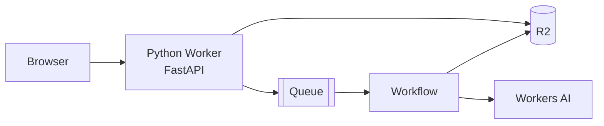

# Image Redraw — FastAPI + R2 + Queues + Workflows + Workers AI

[](https://deploy.workers.cloudflare.com/?url=https://github.com/cloudflare/python-workers-examples/tree/main/20-image-redraw)

Upload a picture and get it back redrawn as a wobbly MS Paint doodle.

This example demonstrates how to leverage multiple Cloudflare services to
create a full-featured image processing pipeline using Python Workers.

## What it uses

- [Python Workers](https://developers.cloudflare.com/workers/languages/python/) — the runtime
- [FastAPI](https://fastapi.tiangolo.com/) — the HTTP API, served over ASGI
- [R2](https://developers.cloudflare.com/r2/) — stores uploaded originals and redrawn outputs
- [Queues](https://developers.cloudflare.com/queues/) — hands work off the request path
- [Workflows](https://developers.cloudflare.com/workflows/) — durable, retrying background execution
- [Workers AI](https://developers.cloudflare.com/workers-ai/) — image generation guided by the uploaded reference
- [Pillow](https://pillow.readthedocs.io/en/stable/) — image normalization inside the Workflow
- [Static Assets](https://developers.cloudflare.com/workers/static-assets/) — the plain HTML/CSS/JS frontend



## The flow

1. The browser POSTs the image bytes to the Worker.
2. FastAPI validates the image and stores the original in R2, and
   enqueues the job.
3. The queue consumer turns each batch of IDs into Workflow instances.
4. The Workflow reads the original from R2, normalizes it with Pillow, calls
   Workers AI, and stores the result back in R2.


## Setup

First ensure that `uv` is installed:
https://docs.astral.sh/uv/getting-started/installation/#standalone-installer

**Workers AI is a remote binding, even during local development.** `wrangler.jsonc`
declares `"ai": { "binding": "AI", "remote": true }`, so inference always runs on
Cloudflare's network and bills against your account. Log in before starting the
dev server:

```sh
uv run pwrangler login
```

## How to Run

```sh
uv run pywrangler dev
```

Then open http://localhost:8787/ in your browser.

## How to deploy

```sh
uv run pywrangler deploy
```
