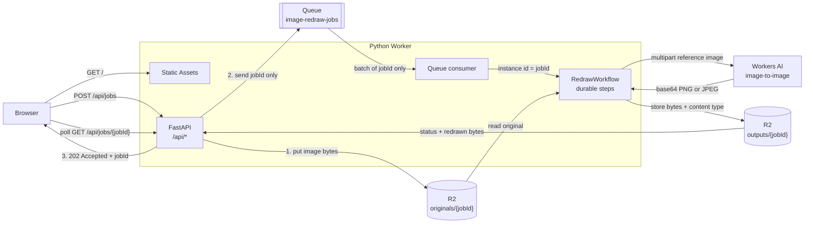

# Image Redraw — FastAPI + R2 + Queues + Workflows + Workers AI

[](https://deploy.workers.cloudflare.com/?url=https://github.com/cloudflare/python-workers-examples/tree/main/20-image-redraw)

Upload a picture and get it back redrawn as a wobbly MS Paint doodle.

This example demonstrates how to leverage multiple Cloudflare services to
create a full-featured image processing pipeline using Python Workers.

- [Python Workers / FastAPI](https://fastapi.tiangolo.com/) - For API server
- [R2](https://developers.cloudflare.com/r2/) - Storing images
- [Workers AI](https://developers.cloudflare.com/workers-ai/) - Image-to-image inference
- [Queues](https://developers.cloudflare.com/queues/) - Work queue
- [Workflows](https://developers.cloudflare.com/workflows/) - Durable execution



The uploaded image is stored in R2 and the job ID is enqueued to the queue. The
queue consumer turns each batch of messages into Workflow instances.
Workflows call the Workers AI API to redraw the image and stores the result in R2.

## Setup

First ensure that `uv` is installed:
https://docs.astral.sh/uv/getting-started/installation/#standalone-installer

**Workers AI is a remote binding, even during local development.** `wrangler.jsonc`
declares `"ai": { "binding": "AI", "remote": true }`, so inference always runs on
Cloudflare's network and bills against your account. Log in before starting the
dev server:

```sh
uv run pwrangler login
```

## How to Run

```sh
uv run pywrangler dev
```

Then open http://localhost:8787/ in your browser.

## How to deploy

```sh
uv run pywrangler deploy
```
